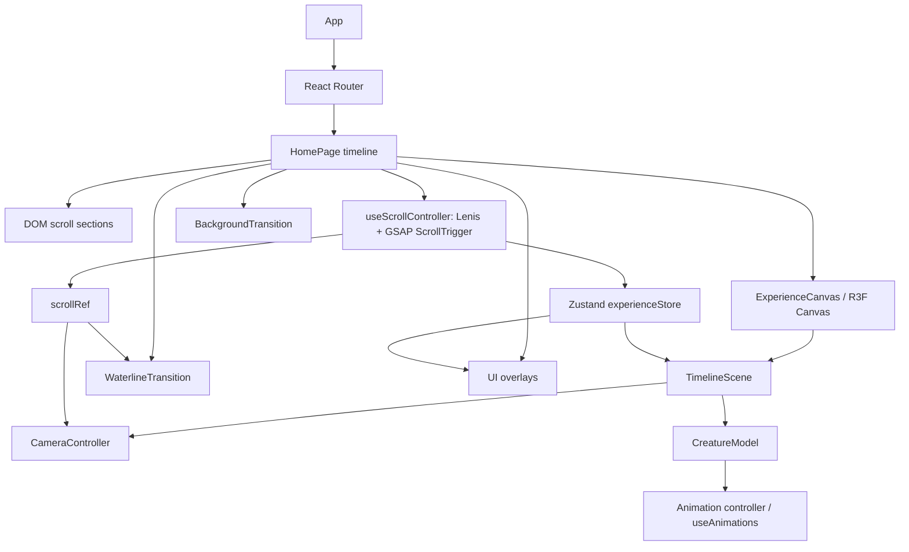

# High-Level Architecture

Last updated: 2026-07-14 00:07 +02:00

# Runtime Data Flow

- Scroll progress: [src/hooks/useScrollController.ts](../src/hooks/useScrollController.ts) reads document progress, writes continuous values to [src/store/scrollRef.ts](../src/store/scrollRef.ts), and uses [src/utils/timeline.ts](../src/utils/timeline.ts) to resolve the active chapter.
- Active era: era intro chapters in [src/data/eras.ts](../src/data/eras.ts) reference `eraId`; UI derives labels from the active chapter/era data.
- Active creature: creature/marine chapters in [src/data/eras.ts](../src/data/eras.ts) reference `creatureId`; the hook [src/hooks/useActiveCreature.ts](../src/hooks/useActiveCreature.ts) resolves IDs against [src/data/creatures.ts](../src/data/creatures.ts).
- Millions-of-years counter: [src/components/timeline/YearCounter.tsx](../src/components/timeline/YearCounter.tsx) reads `scrollRef.progress` and formats `myaAtProgress`.
- Model path: [src/data/creatures.ts](../src/data/creatures.ts) supplies `modelPath`; [src/utils/asset.ts](../src/utils/asset.ts) applies Vite `BASE_URL`; [src/experience/CreatureModel.tsx](../src/experience/CreatureModel.tsx) loads it.
- Animation: `assetFormat`, `animationMode`, `availableAnimations`, and `preferredAnimation` come from [src/data/creatures.ts](../src/data/creatures.ts); detected runtime clips are logged in dev by [src/experience/CreatureModel.tsx](../src/experience/CreatureModel.tsx).
- Camera preset: each creature has a `cameraPreset`; [src/experience/CameraController.tsx](../src/experience/CameraController.tsx) interpolates toward it and adds reduced-motion-aware drift.
- Background: chapter `backgroundId` selects a definition from [src/data/backgrounds.ts](../src/data/backgrounds.ts); [src/components/experience/BackgroundTransition.tsx](../src/components/experience/BackgroundTransition.tsx) crossfades images/gradients.
- Underwater state: creature `sceneType: 'underwater'` feeds [src/utils/water.ts](../src/utils/water.ts), while `underwaterBackgroundId`/chapter background IDs select underwater images.
- Quality level: persisted in [src/store/experienceStore.ts](../src/store/experienceStore.ts), resolved by [src/hooks/useDeviceQuality.ts](../src/hooks/useDeviceQuality.ts), and consumed by [src/experience/ExperienceCanvas.tsx](../src/experience/ExperienceCanvas.tsx), [src/experience/TimelineScene.tsx](../src/experience/TimelineScene.tsx), and [src/components/experience/WaterlineTransition.tsx](../src/components/experience/WaterlineTransition.tsx).
- Scientific mode: persisted in [src/store/experienceStore.ts](../src/store/experienceStore.ts); used by pages and filters to hide stylized entries where configured.

# Scroll Architecture

[src/hooks/useScrollController.ts](../src/hooks/useScrollController.ts) owns Lenis and GSAP ScrollTrigger registration. Lenis provides smooth scrolling unless reduced motion is enabled. ScrollTrigger is synchronized on Lenis scroll events. Continuous progress is kept out of React state by writing to `scrollRef`; only discrete chapter/creature changes enter Zustand through `setActive`.

Programmatic jumps use `scrollToChapter`, which maps a chapter ID to global progress through [src/utils/timeline.ts](../src/utils/timeline.ts), then scrolls with Lenis when available.

# Three.js Architecture

- Canvas ownership: [src/experience/ExperienceCanvas.tsx](../src/experience/ExperienceCanvas.tsx) owns the R3F `Canvas`, performance monitor, DPR/quality settings, and fallback.
- Render loop: R3F handles scene frames; per-frame camera and model updates read refs instead of React state where possible.
- Model lifecycle: [src/experience/TimelineScene.tsx](../src/experience/TimelineScene.tsx) mounts only the active enabled model.
- Loaders: GLB/GLTF uses drei `useGLTF`; FBX/OBJ/STL/PLY are routed through [src/experience/modelLoaders.ts](../src/experience/modelLoaders.ts).
- Disposal: cloned scenes are prepared/normalized per active model; verify disposal behavior before introducing persistent multi-model mounting.
- Animation mixers: [src/experience/CreatureModel.tsx](../src/experience/CreatureModel.tsx) uses drei `useAnimations` and only plays native clips when `animationMode` is `native`.
- Camera system: [src/experience/CameraController.tsx](../src/experience/CameraController.tsx) interpolates camera position/target and respects reduced motion.
- Postprocessing: [src/experience/Effects.tsx](../src/experience/Effects.tsx) is mounted only when quality allows and reduced motion is off.
- Performance controls: [src/hooks/useDeviceQuality.ts](../src/hooks/useDeviceQuality.ts) and R3F `PerformanceMonitor` reduce DPR/effects/particles when needed.

# Asset Loading Strategy

- Current active model: mounted by [src/experience/TimelineScene.tsx](../src/experience/TimelineScene.tsx).
- Next asset preloading: [src/experience/TimelineScene.tsx](../src/experience/TimelineScene.tsx) preloads only the next enabled GLB/GLTF model with `useGLTF.preload`; non-GLTF formats load on demand.
- Lazy route loading: [src/app/App.tsx](../src/app/App.tsx) lazy-loads route pages.
- Error handling: model rendering is wrapped in [src/components/system/ErrorBoundary.tsx](../src/components/system/ErrorBoundary.tsx); missing or disabled entries are not part of the active manifest.
- Format support: `glb`, `gltf`, `fbx`, `obj`, `stl`, and `ply` are schema-supported; OBJ+MTL chaining is not currently implemented.
- Base path: public asset URLs go through [src/utils/asset.ts](../src/utils/asset.ts) or `import.meta.env.BASE_URL` helpers for GitHub Pages compatibility.

# Responsive and Accessibility Architecture

- Desktop and mobile overlays are split in [src/pages/HomePage.tsx](../src/pages/HomePage.tsx), with separate mobile navigation/timeline components.
- Reduced motion is synced in [src/hooks/useReducedMotion.ts](../src/hooks/useReducedMotion.ts) and affects Lenis smoothing, camera drift, particles, postprocessing, cursor behavior, and water animation.
- Keyboard/navigation support includes route links and command palette behavior in [src/components/navigation/CommandPalette.tsx](../src/components/navigation/CommandPalette.tsx).
- Fallback behavior includes DOM text sections, CSS backgrounds, and route fallback UI.
- Desktop creature chapters are arranged left-to-right as geological timeline, facts panel, chapter copy, and right-side 3D model. Tablet/mobile keep the compact bottom panel layout.

# Architectural Decisions

- Data manifests drive chapter order, model identity, scientific status, backgrounds, credits, and UI labels.
- Continuous scroll progress lives in a mutable ref to avoid React re-render pressure on every frame.
- GLB/GLTF stays on `useGLTF`; other loaders are isolated in a registry.
- Scientific identity is separate from mesh quality through `scientificStatus`, notes, and credit fields.
- The water system is a separate screen-space renderer so it does not risk destabilizing the main R3F scene.
- Aquatic chapters add sparse circular shader bubbles that rise only inside the submerged area.
- Creature data can expose an optional one-shot `audioPath`; the facts panel owns playback and audio credits are listed separately.
- Native creature clips can define an optional `animationPauseSeconds`; Alexornis currently uses a 7 second replay pause.
- Model and contact shadows are disabled because the visual stage uses image-backed environments.
- Assets are served from `public` and resolved with the Vite base path for GitHub Pages.

# Known Risks

- [src/data/eras.ts](../src/data/eras.ts), [src/data/creatures.ts](../src/data/creatures.ts), and [src/data/backgrounds.ts](../src/data/backgrounds.ts) are tightly coupled by string IDs.
- Visual correctness depends on external model scale/orientation and cannot be fully validated by type tests.
- Several large or broken assets exist; enabling them without inspection can hurt performance or break rendering.
- OBJ+MTL and external texture base path support are typed but incomplete.
- Water and scroll behavior are sensitive to chapter ordering and reduced-motion behavior.
